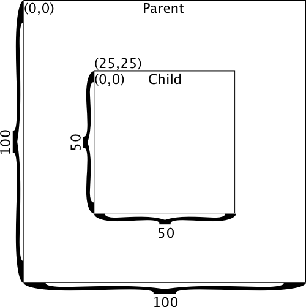

<!-- !b
kind: post
service: blogger
title: UIView Frame vs. Bounds
url: http://blog.adamkemp.com/2014/09/uiview-frame-vs-bounds.html
labels: mobile, ios, layout, xamarin
blog: 6425054342484936402
draft: False
id: 6551544508919726697
-->

The `UIView` class on iOS has several properties related to size and position, and some of them seem to overlap in functionality. It may not be obvious at first which ones to use when or whether there is even a difference, and as a result I have seen many people get confused by how these properties fit together, and many examples of them being used improperly. This post will try to explain how these properties work.

<!--more-->

[TOC]

Coordinate systems
=====

First, let's look at each of the properties that are available on `UIView` for size and position:

* `RectangleF Frame` (`CGRect` in the new unified API[^unified])
* `RectangleF Bounds` (`CGRect`)
* `PointF Center` (`CGSize`)
* `CGAffineTransform Transform`

[^unified]: [Xamarin.Mac and Xamarin.iOS unified API](http://blog.xamarin.com/unified-api-with-64-bit-support-for-ios-and-mac/)

To understand how each of these relate to each other you first need to understand the concept of a coordinate system. A coordinate system is what defines how to interpret an x,y coordinate. What does it mean to say that a view is located at coordinate `(10, 20)`? If a view has a width of 30 then how big is it? Without any context these numbers mean nothing. The coordinate system gives us the context we need to interpret the number.

In iOS, as in many GUI systems, there are actually multiple coordinate systems. The screen has its own coordinate system, but also each view has its own coordinate system. When a view wants to position its subviews it describes their size and position (within itself) using its own coordinate system, which is different from the coordinate system of its parent. To explore this further let's consider an example:

In the above diagram we have two views, `Parent` and `Child`. In case it's not obvious, `Child` is a subview of `Parent`. `Parent` has a size of (100, 100) and `Child` has a size of (50, 50). We want `Child` to be centered within `Parent`. To accomplish this we need the top-left of `Child` to be at the location (25, 25) within `Parent`.

Consider the very center of the image. What coordinate is that point? There is no single answer to this question. It depends on whose coordinate system you want to use. It could be (50, 50) if you are looking at it from the perspective of `Parent`, or it could be (25, 25) if you are looking at it from the perspective of `Child`. This is the first conceptual hurdle to overcome when thinking about layout. Every coordinate and size is only meaningful in the context of a coordinate system (usually defined by a view), and it is important to carefully consider whose coordinate system you are in _and to avoid mixing them_ (more on that later).

As a teaser, let's take a look at the most common mistake I see people make in iOS layout code:

    :::csharp
    public override void ViewDidLayoutSubviews()
    {
        ChildView.Frame = new RectangleF { Width = View.Frame.Width, Height = ChildViewHeight };
        // Also wrong:
        // ChildView.Frame = View.Frame;
    }

Keep this code in mind as you read on and see if you can figure out what the bug is. In the meantime, let's consider some approaches we could take for creating the example view layout form the diagram above.

Option 1: `Frame`
=====

The first option is to set the `Frame` property of `Child`. `Frame` is in the coordinate system of the view's parent so we would set it like this:

    :::chsarp
    Child.Frame = new RectangleF { X = 25, Y = 25, Width = 50, Height = 50 };

For me this is by far the easiest to understand and easiest to code so I almost always do layout using `Frame`. However, there are some cases where this doesn't work, and we'll discuss those later.

Option 2: `Bounds` and `Center`
=====

The second option is to set _both_ `Bounds` and `Center`. These two properties work together to do the same thing as `Frame`. That may sounds stupid. Why would you want to use two separate properties when one would do the same thing? Again, I'll discuss this more shortly. For now let's look at how you use these two properties.

`Bounds` is in the coordinate system of the view itself (not its parent). It is a rectangle, but typically it is only used to set the size of a view. That is, the X and Y are almost always left at (0, 0). _Setting the X and Y of `Bounds` does not change the position of the view relative to its parent._ To set the position of a view within its parent (aside from using `Frame`) you use `Center`.

`Center` is in the coordinate system of the view's parent. That is, this property defines the location in the parent's coordinate system where this view's center should be placed. Putting these two properties together we can set our view's size and position like this:

    :::csharp
    Child.Bounds = new RectangleF { Width = 50, Height = 50 };
    Child.Center = new PointF { X = 50, Y = 50 };

This code has exactly the same effect as the code above that used `Frame` instead. In fact, if you examined `Frame` after running this code you would find that it has the same value as we set in the other code. Likewise, if you use the code that sets `Frame` and then examine `Bounds` and `Center` you will find that they have these same values we set here.

Transforms
=====

Earlier I mentioned that there was a case when you would want to use `Bounds` and `Center` instead of `Frame`. That case is when you also use `Transform`.

`Transform` is a property that is used to modify the size, position, or even rotation of a view within its parent. This property uses a type called `CGAffineTransform`, which is a matrix. The `Transform` is used to convert points in one coordinate system into points in another.

As an example, let's say we wanted our `Child` view to appear as if it were sized at (50, 50), but the actual view is (100, 100). That is, we want to shrink the view to half its size. To accomplish this we use a combination of `Bounds`, `Center`, and `Transform`:

    :::csharp
    Child.Bounds = new RectangleF { Width = 100, Height = 100 };
    Child.Center = new PointF { X = 50, Y = 50 };
    Child.Transform = CGAffineTransform.MakeScale(0.5f, 0.5f);

Here things start to get complicated. First, now that we have a non-identity `Transform` applied the value of `Frame` is undefined. It no longer has any meaning. _`Frame` should never be used when you have a non-identity `Transform`._ That is why it sometimes makes sense to use `Bounds` and `Center` instead of `Frame`.

It is also now harder to reason about how to convert from a coordinate within `Child` to a coordinate in `Parent` (or vice versa). Let's say, for whatever reason, you needed to convert a coordinate in one view into a coordinate in its parent. You might be tempted to write code like this:

    :::csharp
    var xInParent = x + Frame.X;
    var yInParent = y + Frame.Y;

Intuitively this code seems correct, but it is not. It is making an assumption about the relationship between the parent's coordinate system and the child's coordinate system. Basically, it is assuming that the transform is the identity transform. If that assumption turns out to be false then this code will get the wrong answer.

This may seem like a contrived example, but there is a common situation in which it might become an issue. In iOS 7.x[^iOS8] and earlier each `UIWindow`'s coordinate system is pinned. The window ignores the interface orientation. In order to make the UI face the right direction the `RootViewController`'s view has a rotation transform applied to it. This means that the coordinate system of the window is totally different from the coordinate system of the view controller's view. If you try to insert a view directly into the window then you have to very carefully convert between these two coordinate systems.The same situation can arise if you have a scaling transform applied, which would happen if you use `UIScrollView`'s built-in zooming capability.

[^iOS8]: In iOS 8 this story has changed a bit. If you link against the iOS 8 SDK (or later) and your app is running in iOS 8 (or later) the `UIScreen` changes its bounds to match the interface orientation, and each window and its `RootViewController` takes on the same bounds. No rotation transform is applied to the root view controller. You should still not make any assumptions about this because the same app running on iOS 7.1 or earlier would still have the rotation transform, and you never know when Apple might change how this works again.

If you want to write view code that works properly regardless of any transforms that might be applied to it you should carefully consider which coordinate system each coordinate and rectangle is associated with and convert between coordinate systems when necessary. This is why the `UIPopoverController` and `UIMenuController` APIs take both a rectangle _and_ and `UIView`. The view that you give it is used to determine the coordinate system that the rectangle is in.

Converting between coordinate systems
=====

Converting between coordinate systems with transforms involved could be pretty complex. Fortunately, `UIKit` provides some useful functions that make this easy:

* `PointF ConvertPointFromView(PointF point, UIView fromView)`
* `PointF ConvertPointToView(PointF point, UIView toView)`
* `RectangleF ConvertRectangleFromView(RectangleF point, UIView fromView)`
* `RectangleF ConvertRectToView(RectangleF point, UIView toView)`

In iOS 8 these were generalized a bit into these methods, which work on `UIScreen` as well:

* `PointF ConvertPointFromCoordinateSpace(PointF point, IUICoordinateSpace coordinateSpace)`
* `PointF ConvertPointToCoordinateSpace(PointF point, IUICoordinateSpace coordinateSpace)`
* `RectangleF ConvertRectFromCoordinateSpace(RectangleF point, IUICoordinateSpace coordinateSpace)`
* `RectangleF ConvertRectToCoordinateSpace(RectangleF point, IUICoordinateSpace coordinateSpace)`

These methods are useful whenever you need to place or size something in one view such that it matches the location or size of something else in a different view. Using these methods you can easily convert from one coordinate system to another even if there are transforms involved.

Avoiding common pitfalls
=====

Let's go back to the first example code shown above:

    :::csharp
    public override void ViewDidLayoutSubviews()
    {
        ChildView.Frame = new RectangleF { Width = View.Frame.Width, Height = ChildViewHeight };
        // Also wrong:
        // ChildView.Frame = View.Frame;
    }

As mentioned previously, this code demonstrates the most common mistake in layout code that I come across. To see what's wrong consider what each variable represents:

* `View.Frame`is the size and location of `View` in _its parent's coordinate system_.
* `ChildView.Frame` is the size and location of `ChildView` in _its_ parent's coordinate system (that is, in `View`'s coordinate system).

These are two different coordinate systems, but they are being mixed without conversion. What happens if `View` has a non-identity transform applied? `Frame` will not have expected value (in fact, it is undefined), and so `ChildView` will not have the correct size.

The commented out code (`ChildView.Frame = View.Frame`) has a more basic problem: `View.Frame` may have a location (relative to `View`'s parent) that doesn't make sense to apply to `ChildView`. Never assume that a view controller's view has a location of (0, 0). That will not always be true.

So what is the fix? It's simple: use `View.Bounds` instead. This works because `View.Bounds` is in the coordinate system of `View`, and `ChildView.Frame` is also in that same coordinate system. Here is the fixed code:

    :::csharp
    public override void ViewDidLayoutSubviews()
    {
        ChildView.Frame = new RectangleF { Width = View.Bounds.Width, Height = ChildViewHeight };
        // Also valid:
        // ChildView.Frame = View.Bounds;
    }

The same mistake can be made for a custom `UIView`:

    :::csharp
    public override void LayoutSubviews()
    {
        // Wrong!
        ChildView.Frame = Frame;
    }

The correct code would be this:

    :::csharp
    public override void LayoutSubviews()
    {
        // Right!
        ChildView.Frame = Bounds;
    }

In order to avoid these kinds of pitfalls here are some rules to live by whenever writing layout code:

1. When looking at the size of your own view _always_ use `this.Bounds` for a `UIView` and `View.Bounds` for a `UIViewController`.
2. When looking at the size of a child view you can use either `Frame` or `Bounds` and `Center`.
3. Always use `Bounds` and `Center` when there are transforms involved.

The first rule can be stated another way: if you see `View.Frame` in a `UIViewController` or `this.Frame` in a custom `UIView` then that is almost certainly a bug. I can't think of any legitimate reasons for a view to look at its own `Frame`. Use `Bounds` instead.

Summary
=====

Here are the most important things to remember from this post:

1. Each view has its own coordinate system.
2. `Frame` is in the coordinate system of the _parent_.
3. `Bounds` is in the coordinate system of the view itself.
4. `Center` is in the coordinate system of the _parent_.
5. Whenever a view has a non-identity transform applied you should always use `Bounds` and `Center` because `Frame` is undefined.
6. Avoid mixing coordinates or rectangles/sizes from different coordinate systems. Use the provided conversion methods if necessary.

